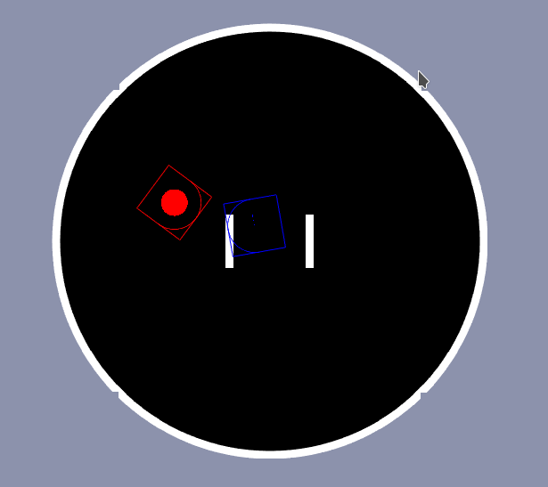

# PySumo

PySumo is a simple Python simulator for robot sumo, designed for use with reinforcement learning algorithms.

## Overview

This simulator is intended for training reinforcement learning algorithms to play a (modified) game of robot sumo. The rules are intentionally nonstandard in order to make the game more complex. For instance, robots have a "boost" they can activate in order to briefly put their motors into overdrive. This must be carefully timed, as it will quickly deplete as indicated by the circle in each robot.

## Installation

PySumo requires you to install the libraries in requirements.txt, as well as [222464/OgmaNeo2](https://github.com/222464/OgmaNeo2/tree/CPU_Q_Epsilon) and the [OgmaCorp/PyOgmaNeo2](https://github.com/ogmacorp/PyOgmaNeo2/tree/CPU_Q_Epsilon) wrapper.

The OgmaNeo2 branch compatible with this simulator is the [CPU_Q_Epsilon branch](https://github.com/222464/OgmaNeo2/tree/CPU_Q_Epsilon) (same goes for [PyOgmaNeo2](https://github.com/ogmacorp/PyOgmaNeo2/tree/CPU_Q_Epsilon)),
although other branches should be compatible as well as long as they support reinforcement learning.

1. Install the requirements.txt file
2. Clone 222464/OgmaNeo2 and switch to the CPU_Q_Epsilon branch
3. Then inside the OgmaNeo2 root directory:

> mkdir build && cd build  
> cmake -DBUILD_SHARED_LIBS=On ..  
> sudo make install  

4. Clone OgmaCorp/PyOgmaNeo2 and switch to the CPU_Q_Epsilon branch
5. Then inside the PyOgmaNeo2 root directory:

> sudo python3 setup.py install

If a build folder exists in PyOgmaNeo2 already, delete it first or compilation may fail.

6. Run PySumo

> python3 main_neo.py

## Usage

Press T to toggle speed mode (run at high framerate to train faster).

## Images

